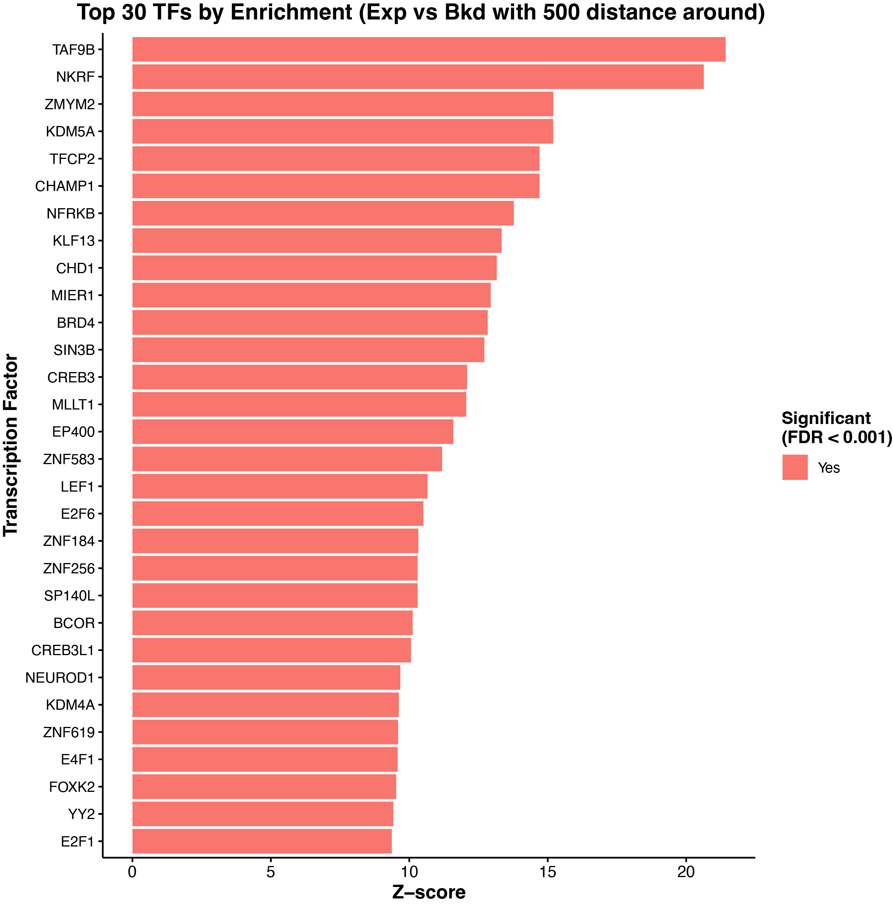

# TF Enrichment Analysis

Statistical analysis tool for identifying enriched transcription factor binding sites in genomic regions compared to the background. This function uses the data for binding sites of all the transcription factors from ENCODE.

## Description

This R script performs transcription factor (TF) enrichment analysis by comparing TF binding site overlap between experimental regions (e.g., Experiment sites) and background regions (e.g., Background sites). It calculates z-scores, p-values with FDR correction, and generates publication-ready visualizations.

## Requirements
```r
library(GenomicRanges)
library(dplyr)
library(ggplot2)
```

## Usage
```r
source("TranscriptionFactor_Enrichment.R")

exp <- readRDS("path/to/your/ipa_regions.rds")          # Your experimental regions (GRanges)
bkd <- readRDS("path/to/your/polya_regions.rds")        # Your background regions (GRanges)
tf_dir <- "path/to/tf_binding_sites/"                   # Directory with TF .rds files
output_plot <- "output/directory/"                      # Output directory
threshold_for_TFs_Enrichment <- 500                     # Distance threshold label from center

results <- run_tf_enrichment_analysis(
    ipa_gr = exp,
    polya_gr = bkd,
    tf_dir = tf_dir,
    output_dir = output_plot,
    exp_name = "Experiment",
    bkd_name = "Background",
    threshold_for_TFs_Enrichment = threshold_for_TFs_Enrichment,
    significance_threshold = 0.001
)
```

## Input Files

- **Experimental regions**: GRanges object (e.g., Experiment sites)
- **Background regions**: GRanges object (e.g., Background sites)  
- **TF binding sites**: Directory containing `.rds` files, each with a GRanges object of TF binding sites

## Output Files

- `TF_enrichment_IPA_PolyA_500bp.csv` - Complete results with statistics
- `TF_enrichment_IPA_PolyA_500bp.rds` - R object for further analysis
- `TF_enrichment_IPA_PolyA_500bp_volcano_plot.pdf` - Volcano plot visualization
- `TF_enrichment_IPA_PolyA_500bp_top_barplot.pdf` - Top 30 enriched TFs bar plot

## Output Columns

| Column | Description |
|--------|-------------|
| TF_name | Transcription factor name |
| Observed_in_Exp | Count in experimental regions |
| Observed_in_Bkd | Count in background regions |
| Expected_in_Exp | Expected count based on background |
| Background_probability | Proportion in background |
| Z_score | Enrichment z-score |
| P_value | Raw p-value |
| P_value_adjusted | FDR-corrected p-value |
| Significant | Yes/No based on threshold |

## Functions

### `analyze_tf_enrichment()`
Core function that processes TF files and calculates enrichment statistics.

### `run_tf_enrichment_analysis()` 
Wrapper function that runs the analysis and generates visualizations.

## Parameters

- `ipa_gr`: Experimental regions (GRanges)
- `polya_gr`: Background regions (GRanges)
- `tf_dir`: Path to TF binding site files directory
- `output_dir`: Output directory path
- `exp_name`: Label for experimental regions (default: "IPA")
- `bkd_name`: Label for background regions (default: "PolyA")
- `threshold_for_TFs_Enrichment`: Distance threshold description (default: "500bp")
- `significance_threshold`: FDR cutoff (default: 0.05)
- `min_overlap`: Minimum base pair overlap (default: 1)

## Statistical Method

1. Calculates background probability as the proportion of background regions overlapping TF sites
2. Computes expected counts in experimental regions based on background frequency
3. Calculates the z-score as the standardized difference between observed and expected
4. Performs a one-tailed test for enrichment
5. Applies Benjamini-Hochberg FDR correction for multiple testing

## Example
```r
# Load libraries
library(GenomicRanges)
library(dplyr)
library(ggplot2)

source("tf_enrichment_analysis.R")

exp <- readRDS("data/ipa_sites.rds")
bkd <- readRDS("data/polya_sites.rds")

results <- run_tf_enrichment_analysis(
    ipa_gr = exp,
    polya_gr = bkd,
    tf_dir = "tf_binding_sites/",
    output_dir = "results/",
    exp_name = "Experiment",
    bkd_name = "Background",
    threshold_for_TFs_Enrichment = 1000,
    significance_threshold = 0.01
)

top_tfs <- results %>%
    filter(Significant == "Yes") %>%
    arrange(P_value) %>%
    head(10)
print(top_tfs)
```
## Ouput Plots
<p align="center">
  
</p>   

<p align="center">
  
</p>   

## Console Output

The script provides detailed progress information:
- Number of TF files found
- Processing status for each TF
- Overlap counts for experimental and background regions
- Statistical metrics (z-score, p-value)
- Summary of significant TFs
- File save locations

## Visualizations

### Volcano Plot
- X-axis: Z-score (enrichment strength)
- Y-axis: -log10(P-value) (significance)
- Red points: Significant TFs (FDR < threshold)
- Gray points: Non-significant TFs

### Bar Plot
- Top 30 TFs ranked by enrichment
- Bar height: Z-score
- Bar color: Significance status

## Troubleshooting

### Common Issues
- **No .rds files found**: Check tf_dir path and file format
- **Zero variance warning**: Normal when TF has no background overlap
- **Memory issues**: Process TFs in batches for large datasets

### File Format
TF binding site files must be:
- Saved as `.rds` format
- Contain valid GRanges objects
- Named by TF (e.g., `CTCF.rds`)
